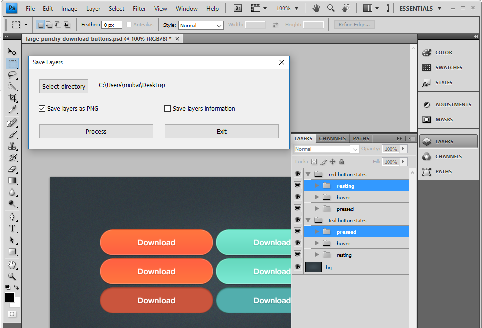

# Photoshop-script-to-slice-PSD

## What it does?

+ Save selected layers to PNG in their respective bounding box size
+ Extract information about selected layers bounding box (dimensions) to text file

## How to use?

Just open a PSD and load this script from File>open menu. This script will execute and display following dialogue.

